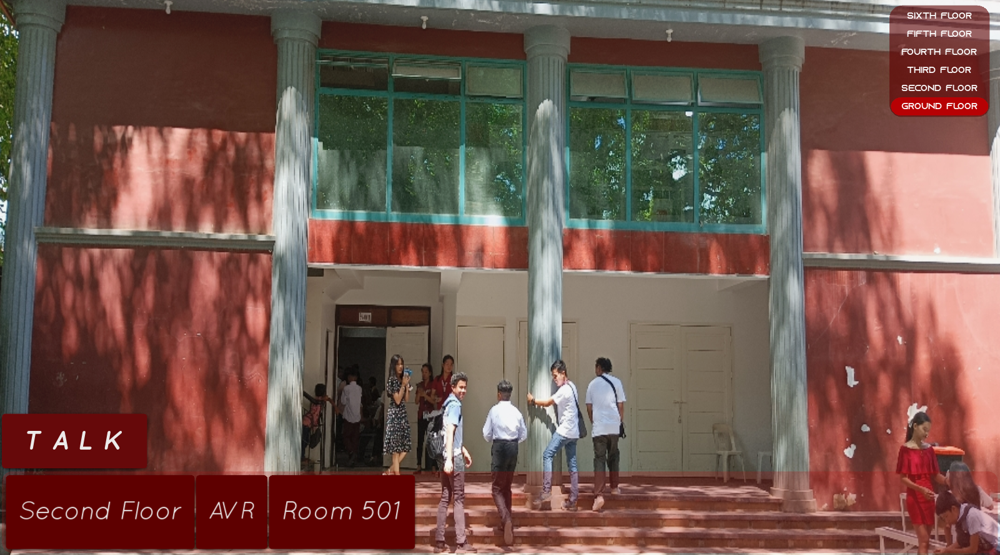
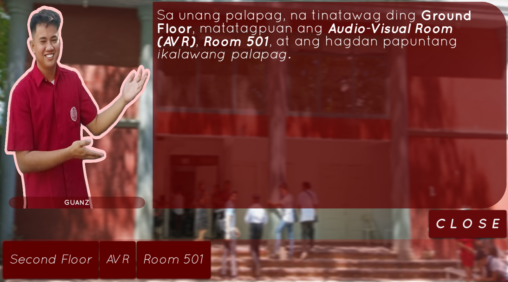

# OC TOUR

## Description
OC TOUR is a mobile application designed to showcase the Computer Science department of Osmena Colleges in an encouraging and entertaining manner. The app features a random person guide, creating an interactive experience akin to conversing with a real person. Users navigate through each floor as if playing a game, gaining insights into the various rooms and their functions within the Computer Science department.

## Usage
OC TOUR boasts a user-friendly interface that makes it easy to navigate and understand.

## Images

## Technology Stack
- **Programming Language:** Python
- **Framework:** Kivy and Kivymd

## Installation
For security reasons, OC TOUR is not available as a standalone Android or iOS app. However, it can be packaged into a mobile application using Buildozer.

## Acknowledgements
- Osmena Colleges Computer Science Department
- Josh Ametin
- Jeremiah Aguilar
- Heart Cumpio
